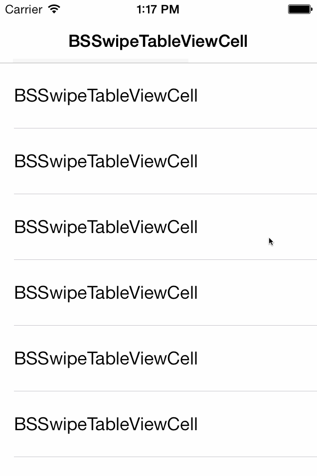

# BSSwipeTableViewCell

BSSwipeTableViewCell is a very customizable table view cell which can be swiped left and right.
What differentiates BSSwipeTableViewCell from other similar solutions is that it uses a delegate to determine which view to show in the sides

  

## Requirements

- ARC must be enabled. If you are not already using ARC, now is a good time.
- Only supports iOS 7.

## Installation

If  you are using CocoaPods (which you should!) you can just add the following to your podfile and run `pod install`.

	pod 'BSSwipeTableViewCell', :git => 'https://github.com/simonbs/BSSwipeTableViewCell.git'

If you are not not using CocoaPods, you should clone this repository and copy BSSwipeTableViewCell/ directory into your project.

When you have installed BSSwipeTableViewCell either using CocoaPods or not, you just need to import the `BSSwipeTableViewCell.h`.

	#import "BSSwipeTableViewCell.h"

## Usage

Coming soon.

## Known Issues

Nothing!

Let me know if you find anything else.

## Demo Project

The repsitory contains a simple example project. This project was used to create the animation shown above.
In the example project, a row is deleted by swiping right. When swiping left, the row will change between two states: checked and unchecked. I keep an array of index paths stored in the controller to check if a row is checked or not.

## Credits

BSSwipeTableViewCell is developed by [@simonbs](http://twitter.com/simonbs), [simonbs.dk](http://simonbs.dk) Feel free to fork the repository and send pull requests if you have made something awesome.

## License

BSSwipeTableViewCell is released under the MIT license. Please see the LICENSE file for more information.